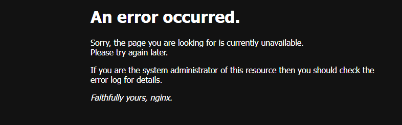
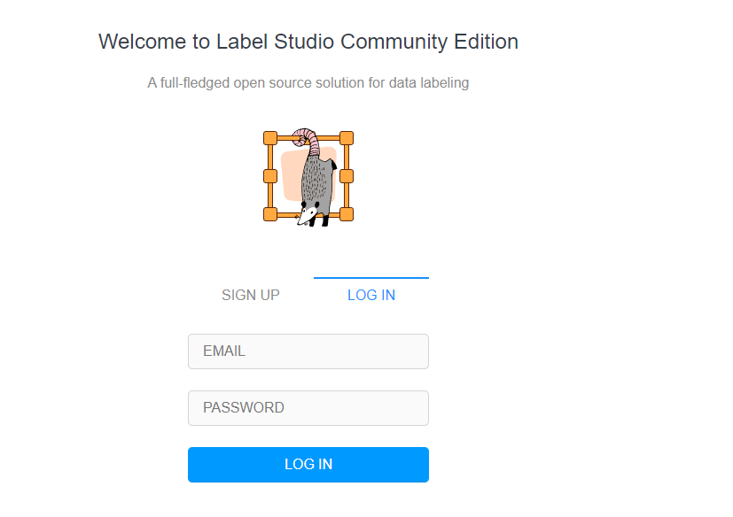

## APP Installation Instructions 

When installing the APP you are asked to set an:
Application ID, Application Name, Password for postgre database.

All these can be chosen by you.
The Application ID should not contain exclusively numeric values. 
The installation takes a few minutes. 

## After the installation

If the following message appears when opening the APP

Please wait some minutes and then reload the page.
The correct page should then appear.

At the sign up tab, you can create an account, using your own email and choosing a password.

