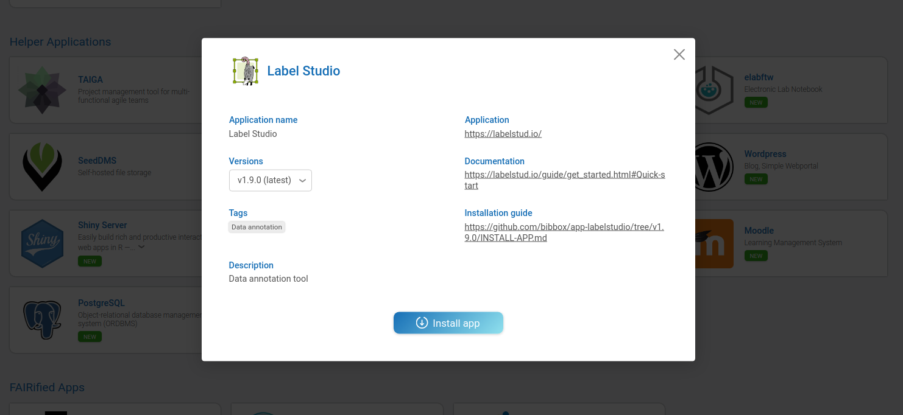
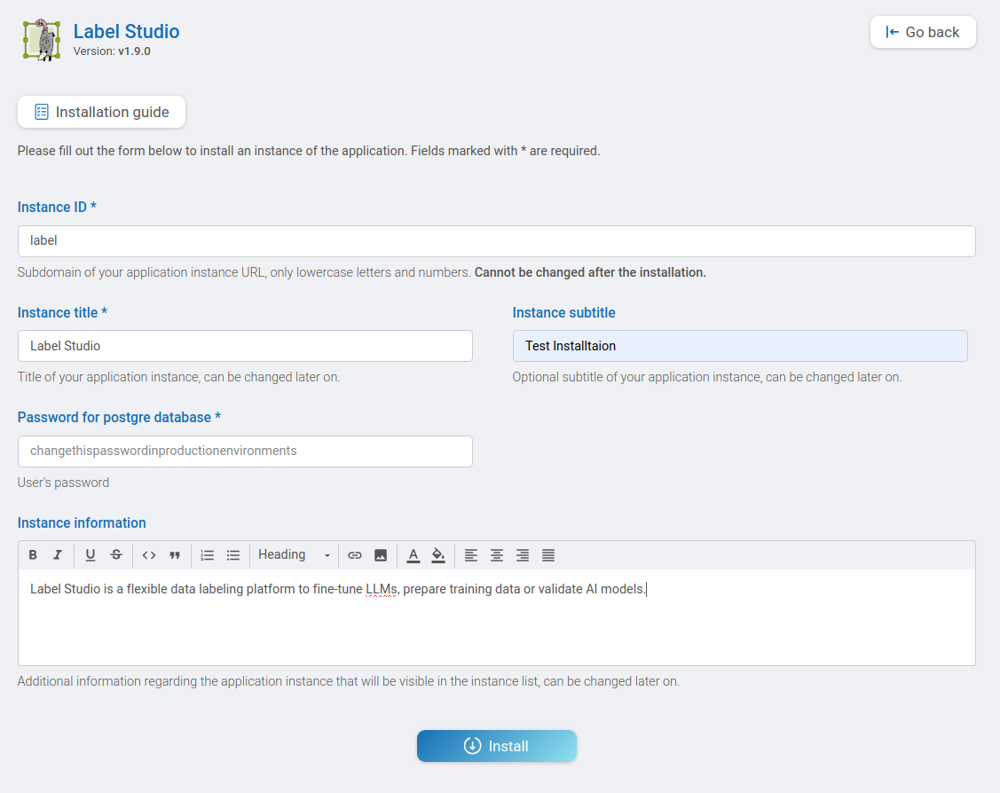
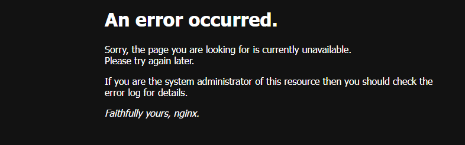
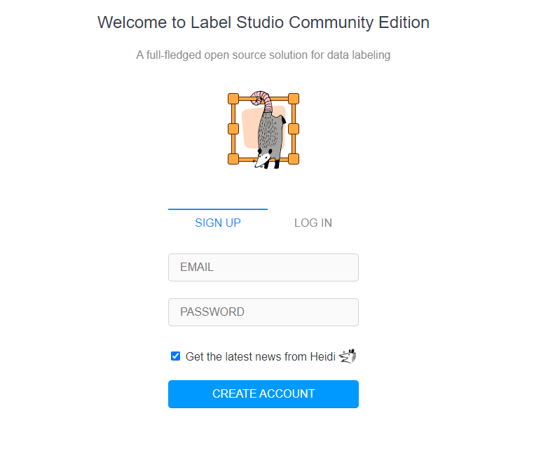

# Label Studio Installation Instructions 

The application can be installed either within the BIBBOX environment or as a stand-alone solution. Installation instructions can be found within the BIBBOX, followed by setup instructions required once the application has been successfully installed.

## Installation within in the BIBBOX

Once you've selected the desired App for your BIBBOX instance, you can choose from the available versions, as shown in the following figure.

Clicking "Install App" will open a new window, as illustrated in the following figure. Here, you can define the necessary entries. Some fields come pre-filled with suggested options, and if left unchanged, these default values will be used as the entries.

After confirming by clicking "Install," the App will be installed as a BIBBOX instance. Once the installation is complete, you only need to follow a few steps to use the App for the first time, which are described below.

## Setup after BIBBOX or stand-alone installation

When installing the APP you are asked to set an:
Application ID, Application Name, Password for postgre database.

All these can be chosen by you.
The Application ID should not contain exclusively numeric values. 
The installation takes a few minutes. 

## After the installation

If the following message appears when opening the APP

Please wait some minutes and then reload the page.
The correct page should then appear.

At the sign up tab, you can create an account, using your own email and choosing a password.

